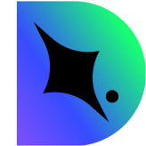
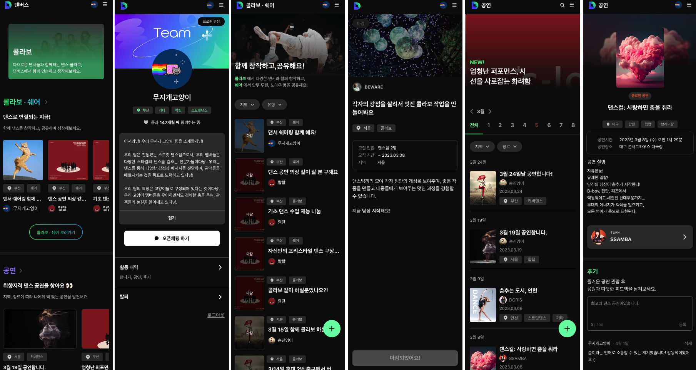
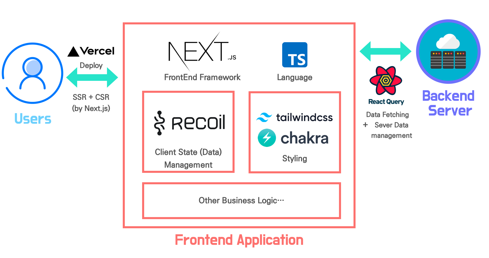

<div align="center">
<a href="https://danverse.vercel.app/">

</a>

<br>

# 🪩춤으로 연결되는 댄스 유니버스, 댄버스💫

프로젝트에 대한 더 자세한 설명은 [Wiki](https://github.com/dnd-side-project/dnd-8th-1-frontend/wiki)에서 확인할 수 있습니다.

</div>

## Table Of content

- [프로젝트 소개](#프로젝트-소개)
- [프로젝트 아키텍쳐](#프로젝트-아키텍처)
- [기술 스택](#기술-스택)
- [시작 하기](#시작-하기)
- [Contributing Guide (협업 규칙)](#contributing-guide-협업-규칙)
- [팀원 소개](#팀원-소개)

<br>

## 프로젝트 소개

댄버스는 **Dan**ce와 Univer**se**의 합성어로,
다양한 사람들이 **댄스**로써 연결되는 종합적 교류 공간입니다.

댄버스는 춤을 추는 댄서/댄스팀을 위한 서비스로
온오프라인 경계없이 댄스로 연결될 수 있는 경험을 제공합니다.

댄버스는 다양한 댄서들이 쉽게 모이고 교류할 수 있는 플랫폼이 되는 것을 목표로 합니다. 댄버스를 통하여 더 많은 댄서/댄스팀을 탐색하고 콜라보, 쉐어를 통해 소통하는 기회를 만들 수 있습니다.

댄버스는 공연정보가 모이고 홍보할 수 있는 공간 입니다. 또한, 댄스 공연에 대한 응원과 피드백 등 관람객의 목소리를 생생하게 공유할 수 있습니다.

댄버스의 사용법의 경우 Wiki의 [페이지별 기능](<https://github.com/dnd-side-project/dnd-8th-1-frontend/wiki/How-To-Use-(%ED%8E%98%EC%9D%B4%EC%A7%80%EB%B3%84-%EA%B8%B0%EB%8A%A5)>)부분을 읽어보세요.



<br>

## 프로젝트 아키텍처



<br>

## 기술 스택

### 언어


### 프레임워크


### 라이브러리


<br>

## 시작 하기

### [자세한 내용은 wiki - getting started를 참고해주세요!](https://github.com/dnd-side-project/dnd-8th-1-frontend/wiki/Getting-Started#-localhostpem-localhost-keypem-download)

- 개발 환경

  
  
  

<br/>

<h4> 1. 레포지토리 클론 </h4>

```bash
git clone https://github.com/dnd-side-project/dnd-8th-1-frontend.git
```

<br/>

<h4> 2. <code>localhost.pem</code>, <code>localhost-key.pem</code> Download (mac 유저만 해당되며, window 유저일 경우 wiki 내 <a href="https://github.com/dnd-side-project/dnd-8th-1-frontend/wiki/Getting-Started">localhost.pem, localhost-key.pem Download 섹션</a> 참고해 주세요 :) </h4>

```bash
yarn init-https
```

<br/>

<h4> 3. 환경 변수 파일 추가<code>(.env.development)</code> </h4>

```bash
NEXT_PUBLIC_API_END_POINT=https://danverse.o-r.kr/
NEXT_PUBLIC_GOOGLE_CLIENT_ID=660329626176-s20348mpdpcu5gojab3g4jl92lphm7n3.apps.googleusercontent.com
NEXT_PUBLIC_GOOGLE_REDIRECT_URI=https://localhost:3001/oauth/callback
NEXT_PUBLIC_GOOGLE_CLIENT_SECREET=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
```

<br/>

<h4> 4. yarn 버전 확인 후 <code>yarn 1.x</code> 버전일 경우 적용 </h4>

```bash
yarn set version berry
```

<br/>

<h4> 5. vs code extension <code>ZipFS</code> 설치 </h4>


<br/>

<h4> 6. vs code allow 설정 </h4>


- 다음과 같은 박스가 로드 된다면 allow 클릭

<br/>

<h4> 7. yarn berry <code>unplug file</code> 설치 </h4>

```bash
yarn unplug
```

<br/>

<h4> 8. local 실행 </h4>

```bash
yarn dev
```

<br/>

<h4> 9. storybook 실행 </h4>

```bash
yarn storybook
```

## Contributing Guide (협업 규칙)

Danverse Wiki의 Contribution Guide를 참고해주세요 :)

- [Contributing Guide 바로 가기](https://github.com/dnd-side-project/dnd-8th-1-frontend/wiki/Contributing-Guide)

<br/>

## 팀원 소개

<div align="center">
<br />
<table>
  <tr>
    <td align="center">
      
    </td>
    <td align="center">
      
    </td>
  </tr>
  <tr>    
    <td align="center">
      <a href="https://github.com/jinyoung234">
        <div>손진영</div>
      </a>
    </td>
    <td align="center">
      <a href="https://github.com/dar-jeeling">
        <div>김다은</div>
      </a>
    </td>
  </tr>
</table>
<br />
</div>
